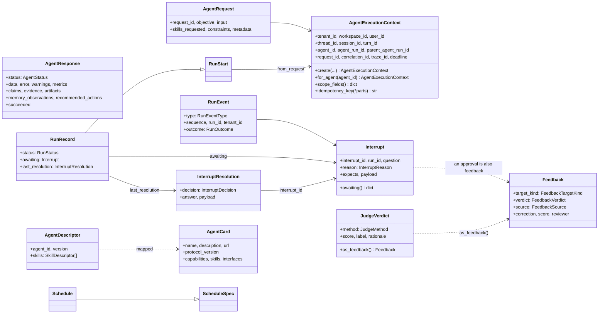

# trellis-contracts

The types an agent must accept and return. No runtime, no transport, no I/O.

Every other repo in the platform depends on this one, and this one depends on nothing but
`pydantic`. That is the point: the contract can be read, versioned and reasoned about
without pulling in a gateway, a database or an agent framework.

## What is in here

| Module | What it defines |
| --- | --- |
| `messages` | `AgentRequest`, `AgentResponse`, `AgentStatus`: the two ends of one execution |
| `context` | `AgentExecutionContext`: tenant, user, thread, agent, run lineage, and `scope_fields()`, the exact keyword arguments the Memory Service expects |
| `artifacts` | What an execution produces on the way: artifact and evidence references, claims, recommended actions, memory observations, warnings |
| `tool` | `ToolSpec`, `ToolCall`, `ToolOutcome`, `ToolStatus` |
| `model` | `ModelRequest`, `ModelResponse`, `ModelUsage` |
| `errors` | The typed failures a caller can branch on, `AgentPaused`, and `classify()` |
| `events` | `LifecycleEvent`, `AgentEvalEvent` |
| `descriptors` | `AgentDescriptor`, `SkillDescriptor` |
| `runs` | `RunStart`, `RunRecord`, `RunStatus`, the `RunEvent` stream, `Interrupt` and `InterruptResolution`, `ScheduleSpec` and `Schedule` |
| `feedback` | `Feedback` with its target kinds, verdicts and sources |
| `evaluation` | `JudgeVerdict`, `JudgeMethod` |
| `a2a` | `AgentCard` and its parts, mapped from `AgentDescriptor` |
| `ports` | Every outbound dependency as a Protocol: model, tool, artifact, memory, telemetry, evaluation, prompt, policy, registry, event sink, run store, scheduler, feedback store, judge, agent directory, interceptor, framework adapter |
| `ids` | `new_id`, `stable_id`, `safe_id`, `now` |

## The shape of it

Two halves. **Records** travel between processes — a request, a result, a run event, a pause, a
judgement. **Ports** are the outbound dependencies, as `Protocol`s, so a harness can be built
against the seam and a service swapped behind it.



The ports, all of them, in one picture:

```mermaid
classDiagram
  direction LR
  class ModelClient {
    <<Protocol>>
    invoke()
    structured()
    stream()
  }
  class ToolClient {
    <<Protocol>>
    list_tools()
    call()
  }
  class ArtifactClient {
    <<Protocol>>
    put()
    get()
  }
  class MemoryPort {
    <<Protocol>>
    retrieve()
    observe()
    record_input()
    record_output()
    describe()
  }
  class TelemetryProvider {
    <<Protocol>>
    start_span()
    record_event()
    record_metric()
    flush()
  }
  class TelemetryRedactor {
    <<Protocol>>
    redact_attributes()
    redact_input()
    redact_output()
  }
  class EvaluationProvider {
    <<Protocol>>
    score()
    submit_dataset_item()
    submit_feedback()
  }
  class EvaluationSink {
    <<Protocol>>
    emit(AgentEvalEvent)
  }
  class PromptProvider {
    <<Protocol>>
    get_prompt()
  }
  class AgentPolicyProvider {
    <<Protocol>>
    authorize_execution()
    authorize_tool()
    authorize_model()
  }
  class AgentRegistryClient {
    <<Protocol>>
    register()
    heartbeat()
  }
  class EventSink {
    <<Protocol>>
    publish(RunEvent)
  }
  class RunStore {
    <<Protocol>>
    started()
    paused()
    resumed()
    finished()
    get()
    list_paused()
  }
  class Scheduler {
    <<Protocol>>
    create()
    get()
    list_for_tenant()
    set_enabled()
    delete()
  }
  class FeedbackStore {
    <<Protocol>>
    submit()
    list_for()
  }
  class Judge {
    <<Protocol>>
    judge()
  }
  class AgentDirectory {
    <<Protocol>>
    get()
    find()
    publish()
  }
  class AgentInterceptor {
    <<Protocol>>
    before()
    after()
    on_error()
  }
  class LifecycleListener {
    <<Protocol>>
    on_event()
  }
  class FrameworkAdapter {
    <<Protocol>>
    supports()
    wrap()
    extract_context()
    map_result()
  }
```



Each is a `Protocol`, so an implementation conforms by shape and nothing imports a base class from
here. `trellis-harness`'s `tests/contract/test_ports.py` asserts each of its adapters against the
protocol it claims.

## Versions, and what goes with what

The packages move together; a combination is "supported" when a test run exercised it, not when it
merely installs.

| Package | Version | Notes |
|---|---|---|
| `trellis-contracts` | **0.3.0** | this package: contracts v2 — `RunEvent`, `Interrupt`, `Feedback`, `AgentCard`, and the ports `EventSink`, `RunStore`, `Scheduler`, `FeedbackStore`, `Judge`, `AgentDirectory` |
| `trellis-harness` | **0.3.0** | declares `trellis-contracts>=0.2`; 0.3.0 is the pair its `compatibility-matrix.json` records |
| `trellis-memory` (Memory Service SDK) | **0.2.1** | what the harness's memory port is written against |
| `pydantic` | `>=2.13,<3` | the only runtime dependency |
| Python | `>=3.12` | `StrEnum`, PEP 695 generics |

Two wire conventions worth knowing when reading the records:

* **What the platform writes and streams refuses unknown fields** — `RunStart`, `RunEvent`,
  `Interrupt`, `InterruptResolution`, `Feedback`, `JudgeVerdict`, `ScheduleSpec` — so a producer's
  typo is an error rather than a silently dropped field. What is *read back* from a store
  (`RunRecord`, `Schedule`) or from another agent (`AgentCard`) **ignores** them, so a newer peer
  does not break an older reader.
* **Every timestamp is timezone-aware.**

One version caveat, stated rather than hidden: `A2A_PROTOCOL_VERSION` in `contracts/a2a.py` is
`"0.3.0"` and is what a card carries when nobody sets one, while the A2A server in
`trellis-harness-a2a` overrides it with the installed `a2a-sdk`'s `PROTOCOL_VERSION_CURRENT`
(`"1.0"` at a2a-sdk 1.1.5). A card served over the wire therefore says `1.0`; a card built here and
never served says `0.3.0`. The constant is stale, not the server.

## Install

```bash
uv add trellis-contracts
```

## The one rule

`AgentExecutionContext.scope_fields()` applies the Memory Service's coherence rules at this
boundary — `agent_run_id` needs `agent_id`, `session_id` needs `thread_id`, `turn_id` needs
`session_id` — so a context that cannot be expressed coherently is corrected here rather
than rejected at the far end of an HTTP call.

## Tests

```bash
uv run pytest
```

## Contracts v2

Beyond the request/response pair, the package carries the seams the rest of the platform
builds on (ADR 0001 in `docs/adr`): `RunEvent` (the AG-UI event vocabulary plus
`CONTEXT_LOADED` and `INTERRUPT`), `Interrupt` and `InterruptResolution` (one pause
mechanism for every framework; approve, reject or edit of a tool call is also `Feedback`),
`Feedback` (human, judge and interrupt judgements on runs, answers, memories, tool calls,
briefs and procedures), `JudgeVerdict`, `AgentCard` (the A2A 0.3.0 card mapped from
`AgentDescriptor`), `RunRecord`, `RunStart`, `ScheduleSpec` and `Schedule`, and the ports
`EventSink`, `RunStore`, `Scheduler`, `FeedbackStore`, `Judge` and `AgentDirectory`.

```python
from trellis.contracts import (
    AgentExecutionContext, AgentPaused, Interrupt, InterruptDecision, InterruptResolution,
    RunEvent, RunOutcome,
)

ctx = AgentExecutionContext.create(tenant_id="acme", user_id="u1", agent_id="refund-agent")
interrupt = Interrupt.from_paused(
    AgentPaused("Approve the refund?", expects={"type": "boolean"}), context=ctx
)
event = RunEvent.finished(ctx, RunOutcome.INTERRUPT, sequence=7, interrupt=interrupt)
answer = InterruptResolution(
    interrupt_id=interrupt.interrupt_id,
    run_id=interrupt.run_id,
    decision=InterruptDecision.ANSWER,
    answer=True,
)
```

Records the platform writes and streams (`RunStart`, `RunEvent`, `Interrupt`,
`InterruptResolution`, `Feedback`, `JudgeVerdict`, `ScheduleSpec`) refuse unknown fields;
records read back from a store (`RunRecord`, `Schedule`) and cards read from another agent
(`AgentCard`) ignore them. Every timestamp is timezone-aware.
