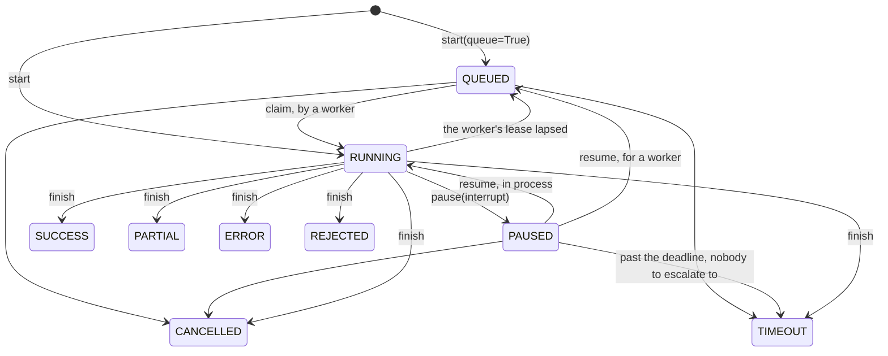

# trellis-contracts

The types an agent must accept and return. No runtime, no transport, no I/O.

The platform's agent harness (`agent-harness`) and run service (`agent-runs`) build on this
package. It depends on nothing but `pydantic`, and that is the point: the contract can be read,
versioned and reasoned about without pulling in a gateway, a database or an agent framework.
It is importable as `trellis.contracts`.

It holds two kinds of thing. **Records** travel between processes: a request, a result, a run
event, a pause, a judgement. **Ports** are the outbound dependencies, written as `Protocol`s,
so a harness can be built against the seam and a service swapped in behind it.
[docs/ARCHITECTURE.md](docs/ARCHITECTURE.md) has the diagrams: who uses what, how the modules
and ports relate, the run lifecycle, and the main models.

## Install

```bash
uv add trellis-contracts
# or, from a sibling checkout, the way agent-harness and agent-runs do it:
uv add --editable ../agent-contracts
```

It needs Python 3.12 or newer and `pydantic>=2.13,<3`.

## Quickstart

An application creates the context once per execution. An agent takes a request and returns a
response:

```python
from trellis.contracts import (
    AgentExecutionContext,
    AgentRequest,
    AgentResponse,
    Claim,
    EvidenceRef,
    RunRecord,
    RunStart,
    RunStatus,
)

ctx = AgentExecutionContext.create(
    tenant_id="acme",
    user_id="u1",
    agent_id="analyst",
    thread_id="chat-42",
    turn_id="t3",
    timeout_seconds=30,
)
request = AgentRequest.create(ctx, "Why did revenue fall?")

response = AgentResponse.ok(
    "Revenue fell 4% on lower renewals.",
    claims=[Claim(claim_id="c1", text="Revenue fell 4%", evidence_ids=["chunk_1"])],
    evidence=[EvidenceRef(source_id="chunk_1", citation="Q3 report, p. 4")],
)
assert response.succeeded

# The Memory Service's Scope keywords, made coherent: a turn with no session gets one.
assert ctx.scope_fields()["session_id"] == "chat-42-session"

# What agent-runs keeps, and the one transition check.
record = RunRecord.from_start(RunStart.from_request(request))
assert record.status is RunStatus.RUNNING and record.status.can_become(RunStatus.PAUSED)
```

A run that pauses to ask a person, streams that it did, and gets an answer:

```python
from trellis.contracts import (
    AgentExecutionContext,
    AgentPaused,
    Interrupt,
    InterruptDecision,
    InterruptReason,
    InterruptResolution,
    RunEvent,
    RunOutcome,
)

ctx = AgentExecutionContext.create(tenant_id="acme", user_id="u1", agent_id="buyer")
interrupt = Interrupt.from_paused(
    AgentPaused("Which supplier?"),
    context=ctx,
    reason=InterruptReason.CHOICE,
    ui="choice",
    options=["Acme", "Globex"],
    assignee="role:procurement",
)
event = RunEvent.finished(ctx, RunOutcome.INTERRUPT, sequence=7, interrupt=interrupt)
answer = InterruptResolution(
    interrupt_id=interrupt.interrupt_id,
    run_id=interrupt.run_id,
    decision=InterruptDecision.ANSWER,
    answer="Globex",
)
assert answer.resolves(interrupt)
assert event.data["interrupt"]["options"] == ["Acme", "Globex"]
```

## Which type do I use?

| When you want to... | Use |
| --- | --- |
| start an execution from an application | `AgentExecutionContext.create(...)`, then `AgentRequest.create(ctx, input)` |
| call a nested agent | `ctx.for_agent("worker")`: it keeps the tenant, user, thread and trace, makes this run the parent, and never extends the deadline |
| return a result from an agent | `AgentResponse.ok(data)`, `AgentResponse.failed(error)`, or `AgentResponse.coerce(anything)` to wrap an existing return value |
| say where an answer came from | `Claim` with `evidence_ids`, plus `EvidenceRef`s on `AgentResponse.evidence` |
| return something too large for the result | `ArtifactClient.put(...)`, which returns an `ArtifactRef` |
| ask the Memory Service to remember something | `MemoryObservation`, whose `kind` must be one of `OBSERVATION_KINDS` (the `ObservationKind` literal) |
| propose a next step instead of calling another agent | `RecommendedAction` |
| report a non-fatal problem | `response.add_warning(code, message, **details)`, which adds an `AgentWarning` |
| fail in a way callers can branch on | raise a `HarnessError` subclass; turn any exception into an `AgentError` with `AgentError.of(exc, source=...)`, where `source` is an `ErrorSource` |
| ask a person something in the middle of a run | raise `AgentPaused(question)` in the agent; the harness turns it into an `Interrupt` with `Interrupt.from_paused` |
| get a tool call approved before it runs | `Interrupt(reason=InterruptReason.APPROVAL, tool_call=ToolCall(...))` |
| record how a person answered | `InterruptResolution`; for an approve, reject or edit of a tool call, `resolution.to_feedback(interrupt, ctx)` gives the matching `Feedback` |
| record a judgement on a run, answer, memory, tool call, brief or procedure | `Feedback.for_context(ctx, target_kind=..., target_id=..., verdict=...)` |
| score a finished run automatically | a `Judge` returns a `JudgeVerdict`; `verdict.as_feedback(event)` turns it into judge `Feedback` on the `AgentEvalEvent`'s answer |
| keep a run beyond the process, or queue it for a worker | `RunStart.from_request(request)`, then `RunsClient.start(start)` or `RunsClient.start(start, queue=True)` from `trellis.runs` (the agent-runs SDK), which return a `RunRecord` |
| check whether a status change is allowed | `RunStatus.can_become(target)` |
| stream progress to a UI | the `RunEvent` constructors (`started`, `text`, `tool`, `interrupt`, `custom`, `finished`), sent with `EventSink.publish` |
| run an agent on a schedule | `ScheduleSpec` is what a caller writes; `Schedule` is what agent-runs returns |
| publish an agent to other agents | `AgentDescriptor.build(...)`, then `AgentCard.from_descriptor(descriptor, url=...)`, then `card.to_a2a()` |
| read another agent's card | `AgentCard.from_a2a(json)`, which drops unknown keys and refuses non-http(s) URLs |
| describe, call and report tools | `ToolSpec` (`descriptor()` is the Memory Service shape), `ToolCall`, `ToolOutcome` with its `ToolStatus` |
| call a model provider-neutrally | `ModelRequest`, a `ModelClient`, `ModelResponse.coerce(raw)`, and `ModelUsage.extract(raw)` for token counts |
| scope a Memory Service call | `ctx.scope_fields()` |
| make a write idempotent across retries | `ctx.idempotency_key(*parts)`, or `stable_id(*parts)` |
| log with the run's identifiers | `ctx.log_fields()` |

## Everything it exports

Every name below is in `trellis.contracts.__all__` and importable from `trellis.contracts`.

### `context`

| Name | What it is |
| --- | --- |
| `AgentExecutionContext` | The frozen identity and lineage of one execution: tenant, user, thread, agent, run lineage, correlation ids and an absolute deadline. Build it with `create`, derive a child with `for_agent`, and use `scope_fields()`, `idempotency_key()` and `log_fields()` |

### `messages`

| Name | What it is |
| --- | --- |
| `AgentRequest` | What an agent was asked to do: objective, input, context, requested skills, constraints and references. `query` is the text a memory retrieval should use |
| `AgentResponse` | What an agent produced: status, data, claims, evidence, artifacts, memory observations, recommended actions, warnings, metrics and error |
| `AgentStatus` | How an execution ended (`SUCCESS`, `PARTIAL`, `ERROR`, `TIMEOUT`, `CANCELLED`, `REJECTED`), or `PAUSED`. `ok` is true for `SUCCESS` and `PARTIAL` |

### `artifacts`

| Name | What it is |
| --- | --- |
| `ArtifactRef` | A pointer to content stored outside the result |
| `EvidenceRef` | Where a claim came from, in the Memory Service's evidence shape |
| `Claim` | One assertion an agent made, with the ids of its evidence |
| `RecommendedAction` | A next step the agent proposes, with a short rationale |
| `MemoryObservation` | Something the agent wants remembered. Its `kind` is checked against `OBSERVATION_KINDS` |
| `ObservationKind` | The `kind` literal: `MESSAGE`, `FILE`, `AGENT_RESULT`, `TOOL_RESULT`, `DECISION`, `FEEDBACK`, `EVENT`, `IMPORT` |
| `AgentWarning` | A non-fatal problem the caller should see |
| `OBSERVATION_KINDS` | The observation kinds the Memory Service accepts |

### `tool`

| Name | What it is |
| --- | --- |
| `ToolSpec` | What a tool is: name, schemas, source or server, idempotency, side effects and authorization metadata |
| `ToolCall` | One call: the tool, its arguments, and an optional idempotency key |
| `ToolOutcome` | The normalised result of a call. Assignments are validated |
| `ToolStatus` | `ok`, `error`, `timeout`, `rejected`, `cancelled`. It is a `StrEnum`, so `outcome.status == "ok"` holds |
| `ToolSource` | Where a tool comes from, `ToolSpec.source`: `local`, `mcp`, `memory`, `openapi`, `a2a` |

### `model`

| Name | What it is |
| --- | --- |
| `ModelRequest` | One model invocation: model, provider, prompt or messages, params and tools |
| `ModelResponse` | The normalised result. `raw` keeps the provider object, and `coerce` wraps any provider response |
| `ModelUsage` | Token and cost accounting. `extract` reads the common provider spellings and never invents counts |

### `errors`

| Name | What it is |
| --- | --- |
| `AgentError` | A normalised, serialisable failure with `category`, `retryable` and `source`. `AgentError.of(exc)` builds one from any exception, keeping the exception's own `retryable` when it has one |
| `ErrorCategory` | The closed set of failure categories |
| `ErrorSource` | The components that report failures, `AgentError.source`: `agent-runs`, `tools`, `mcp`, `a2a`, `memory` and the harness's adapters (`function`, `langgraph`, `openai_agents`, `claude_agent_sdk`, `react`). A qualified `mcp.<tool>` is stored as `mcp` with the tool in `details.source_detail` |
| `ERROR_SOURCES` | `ErrorSource` as a set |
| `classify` | Best-effort category for any exception, including Memory Service SDK, bifrost-sdk and `httpx` errors matched by class name (nearest class first). Every timeout is `TIMEOUT` |
| `AgentPaused` | Raised by an agent to suspend the run and ask a person something. It is not an error |
| `HarnessError` | Base of the failures a harness raises. Each subclass carries its own `code`, `category` and `retryable` |
| `ConfigurationError` | A misconfiguration (`VALIDATION`) |
| `AgentTimeoutError` | The execution ran out of time (`TIMEOUT`, retryable) |
| `AgentCancelledError` | The execution was cancelled (`CANCELLED`) |
| `PolicyDeniedError` | A policy refused the execution, a tool or a model (`POLICY`) |
| `MemoryUnavailableError` | The Memory Service could not be reached (`MEMORY`, retryable) |
| `ModelError` | A model call failed (`MODEL`) |
| `ToolError` | A tool call failed (`TOOL`) |
| `ToolNotFoundError` | A `ToolError` for a tool that does not exist (`VALIDATION`) |
| `ResultValidationError` | An agent's result failed validation (`VALIDATION`) |

`trellis.contracts.errors` also has `is_pause_signal(exc)`, which recognises `AgentPaused`
and LangGraph's suspend signals by class name, and `RETRYABLE_CATEGORIES`.

### `runs`

| Name | What it is |
| --- | --- |
| `RunStatus` | Where a run is: `QUEUED`, `RUNNING`, `PAUSED` or a final status spelled like `AgentStatus`. `can_become` is the state machine and `final` says whether it has ended |
| `RunStart` | What starting a run records. It is agent-runs' create body, and `from_request` builds it from an `AgentRequest` |
| `RunRecord` | A run as a store keeps it: the start plus status, output, error, the interrupt it waits on, the last resolution, an opaque `checkpoint` and the attempt |
| `RunEvent` | One event of a run's stream, in the AG-UI vocabulary, ordered by `sequence` within an `attempt` |
| `RunEventType` | The event vocabulary: AG-UI's names plus `CONTEXT_LOADED` and `INTERRUPT` |
| `RunOutcome` | How a run finished, as `RUN_FINISHED` reports it. `from_status` maps a settled status to it |
| `Interrupt` | The record of a paused run: the question, the expected answer shape, the UI hint, options, payload, the tool call under approval, the assignee, the deadline and the escalation |
| `InterruptReason` | `QUESTION`, `APPROVAL`, `REVIEW`, `CHOICE`, `AUTH` |
| `InterruptUI` | The control a surface renders, `Interrupt.ui`: `approve`, `form`, `table`, `diff`, `choice` |
| `InterruptResolution` | How an interrupt was answered. `resolves` checks it answers that interrupt, and `to_feedback` gives the feedback for a tool-call decision |
| `InterruptDecision` | `ANSWER`, `APPROVE`, `REJECT`, `EDIT`, `CANCEL` |
| `ScheduleSpec` | A standing intent: which agent, what input, which cadence and timezone, on whose behalf |
| `Schedule` | A schedule as agent-runs keeps it: the spec plus its id, author and the history of its fires |

### `feedback` and `evaluation`

| Name | What it is |
| --- | --- |
| `Feedback` | One judgement about one target. `for_context` binds it to the identity of the request it was given in |
| `FeedbackTargetKind` | `run`, `answer`, `memory`, `tool_call`, `brief`, `procedure` |
| `FeedbackVerdict` | `confirm`, `reject`, `correct`, `approve`, `edit`. `correct` and `edit` need a `correction` |
| `FeedbackSource` | `human`, `judge`, `interrupt` |
| `JudgeVerdict` | A judge's score in [0, 1] with its method, model and cost. `as_feedback` turns it into a `Feedback` |
| `JudgeMethod` | `grounded` (deterministic citation and claim checks) or `llm` |
| `AgentEvalEvent` (from `events`) | What a judge scores a finished run from. It carries references, not payloads |

### `descriptors` and `a2a`

| Name | What it is |
| --- | --- |
| `AgentDescriptor` | An agent's identity and skills. `build` accepts plain skill ids |
| `SkillDescriptor` | One skill: id, version, description, schemas and tags |
| `AgentCard` | The A2A 1.0 Agent Card. `from_descriptor` maps a descriptor, `to_a2a` writes camelCase JSON without the platform's `metadata`, and `from_a2a` reads a foreign card as data |
| `AgentSkill` | A skill on the card |
| `AgentCapabilities` | Streaming, push notifications, state history and extensions |
| `AgentProvider` | The organisation behind the agent, with an http(s) URL |
| `AgentInterface` | Another URL and transport the same agent answers on |
| `A2A_PROTOCOL_VERSION` | `"1.0"`, the protocol `a2a-sdk` 1.x speaks |

### `ids`

| Name | What it is |
| --- | --- |
| `new_id(prefix)` | A fresh opaque id, such as `run_<hex>` |
| `stable_id(*parts, prefix, size)` | A deterministic id derived from its parts, so a retry produces the same id |
| `safe_id(value, max_len)` | Any value coerced into the id alphabet shared with the Memory Service |
| `now()` | The platform clock: timezone-aware UTC |

## The ports

Each port is a `runtime_checkable` `Protocol` in `trellis.contracts.ports`, so an
implementation conforms by shape and imports no base class from here.

| Port | Methods | Use it when you need to |
| --- | --- | --- |
| `ModelClient` | `invoke`, `structured`, `stream` | call a model provider without naming the provider |
| `ToolClient` | `list_tools`, `call` | run tools from local callables, an MCP server or a gateway |
| `ArtifactClient` | `put`, `get` | keep large payloads out of results and graph state |
| `MemoryPort` | `enabled`, `retrieve`, `observe`, `record_input`, `record_output`, `describe` | read from and write to the Memory Service (or switch memory off) |
| `TelemetryProvider` | `start_span`, `record_event`, `record_metric`, `flush` | emit spans, events and metrics |
| `TelemetryRedactor` | `redact_attributes`, `redact_input`, `redact_output` | strip what may not leave the process before it reaches a backend, a UI or a webhook |
| `EvaluationProvider` | `score`, `submit_dataset_item` | write scores and dataset items to the tracing backend (feedback goes to the Memory Service instead) |
| `AgentPolicyProvider` | `authorize_execution`, `authorize_tool`, `authorize_model` | allow or refuse a run, a tool call or a model call |
| `EventSink` | `publish` | deliver a run's `RunEvent` stream: SSE, a webhook outbox, a test collector |
| `Judge` | `judge` | score a finished run off the critical path (`None` means it abstained) |
| `AgentDirectory` | `get`, `find`, `publish` | find agents another agent may call, as `AgentCard`s |
| `AgentInterceptor` | `name`, `order`, `before`, `after`, `on_error` | add an ordered stage to the execution pipeline |

`ports.Runtime` (the object an interceptor is handed) is deliberately `Any`, because the
concrete runtime belongs to whatever executes the agent.

Runs have no port. Their client is `trellis.runs.RunsClient` (pip `trellis-runs`, shipped
from agent-runs), whose verbs are agent-runs' operation ids: `start`, `claim`, `heartbeat`,
`pause`, `resume`, `finish`, `get`, `list`. Its requests and replies are the types here
(`RunStart`, `Interrupt`, `InterruptResolution`, `RunRecord`). Which sibling repo implements which
port today is in [docs/ARCHITECTURE.md](docs/ARCHITECTURE.md#the-ports).

## A run's lifecycle

`RunStatus.can_become(target)` is the one transition check, and agent-runs refuses anything
else. The labels below are `RunsClient` verbs. `RunRecord.from_start` creates a record `QUEUED` or `RUNNING`, and nothing else.



A paused run waits on exactly one `Interrupt`: a `QUESTION`, an `APPROVAL` (carries the tool
call), a `REVIEW` (carries in `expects` what a correction looks like), a `CHOICE` (carries its
`options`) or an `AUTH`. `assignee` is who answers (`user:u1`, `role:procurement`). Past the
`deadline` the run goes to `escalate_to`, or times out when nobody is named.

The executor pauses with an opaque `checkpoint` (`RunsClient.pause(interrupt, checkpoint=)`):
its resume journal and the framework's own resume state. The record returns it on every read
and claim, so another worker resumes without repeating side effects. Finishing clears it.

## The one rule

`AgentExecutionContext.scope_fields()` applies the Memory Service's coherence rules at this
boundary: `agent_run_id` needs `agent_id`, `session_id` needs `thread_id`, and `turn_id` needs
`session_id`. A context that cannot be expressed coherently is corrected here rather than
rejected at the far end of an HTTP call.

## Wire conventions

* **What the platform writes and streams refuses unknown fields**: `RunStart`, `RunEvent`,
  `Interrupt`, `InterruptResolution`, `Feedback`, `JudgeVerdict`, `ScheduleSpec`. A
  producer's typo is an error, not a silently dropped field. What is *read back* from a store
  (`RunRecord`, `Schedule`) or from another agent (`AgentCard`) **ignores** unknown fields, so
  a newer peer does not break an older reader.
* **Every timestamp on a run, interrupt, event, feedback or schedule is timezone-aware.**
* **Every field is documented.** Each model field has a one-line `Field(description=...)`
  (units, formats, allowed values), so agent-runs' OpenAPI document describes every property.
  `tests/test_field_docs.py` fails on a field without one.
* **Closed vocabularies are typed**: statuses, kinds and decisions are `StrEnum`s, and
  `ErrorSource`, `ToolSource`, `ObservationKind` and `InterruptUI` are `Literal`s, so a typo
  is a validation error. ADR 0003 lists the `str` fields left open on purpose.
* **Payloads that leave the process are unredacted** (`RunEvent.data`,
  `Interrupt.awaiting()`). The surface that sends them passes them through a
  `TelemetryRedactor`.

`A2A_PROTOCOL_VERSION` is `"1.0"`, the protocol `a2a-sdk` 1.x speaks. `trellis-harness`'s A2A
surface builds its served card with the SDK's own `PROTOCOL_VERSION_CURRENT`, so the two must
agree; no test in a sibling repo asserts that yet, so a change to either needs the other
checked by hand.

## Versions, and what goes with what

The packages move together. A combination is "supported" when a test run exercised it, not when
it merely installs.

| Package | Version | Notes |
|---|---|---|
| `trellis-contracts` | **0.5.0** | this package: contracts v3 (ADR 0002) without the `RunStore` port (ADR 0004); `trellis.runs.RunsClient` is the runs client |
| `trellis-harness` | **0.4.0** | pins `trellis-contracts>=0.4` |
| `agent-runs` and `trellis-runs` (its SDK) | **0.3.0** | pin `trellis-contracts>=0.4,<0.6` |
| `trellis-memory` (Memory Service SDK) | **0.4.0** | what the harness's memory client is written against |
| `pydantic` | `>=2.13,<3` | the only runtime dependency |
| Python | `>=3.12` | `StrEnum`, PEP 695 generics |

The design decisions are in `docs/adr`: [0001](docs/adr/0001-contracts-v2.md) (runs, events,
interrupts, feedback, judging and agent cards), [0002](docs/adr/0002-contracts-v3.md)
(queued runs, richer interrupts, schedules, and the ports that were removed) and
[0003](docs/adr/0003-documented-fields-and-closed-vocabularies.md) (field descriptions,
`ErrorSource` and the other literals, and how `AgentError.of` reads SDK errors) and
[0004](docs/adr/0004-no-run-store-port.md) (the `RunStore` port is gone; `trellis.runs` is
the runs client).

## Development

```bash
uv sync --all-extras
uv run pytest
uv run ruff check .
uv run ruff format --check .
```

CI (`.github/workflows/ci.yml`) runs the same steps on every push to `main` and every pull
request. One test fails the build if the
package imports anything beyond `pydantic` and the standard library.
