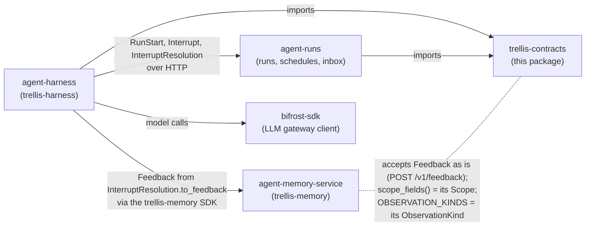
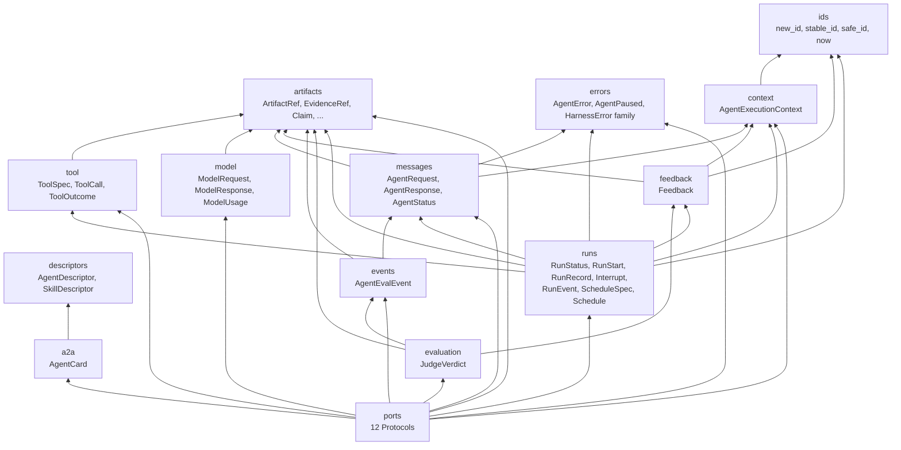
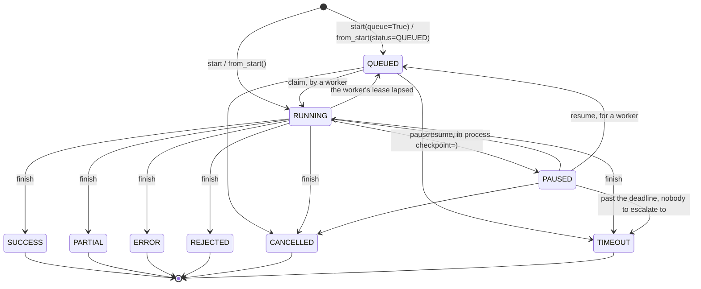
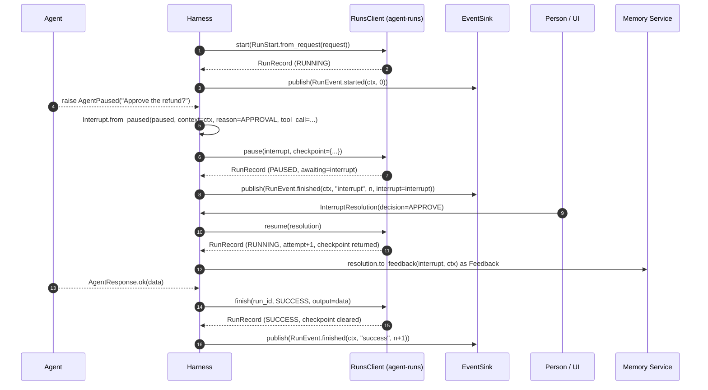
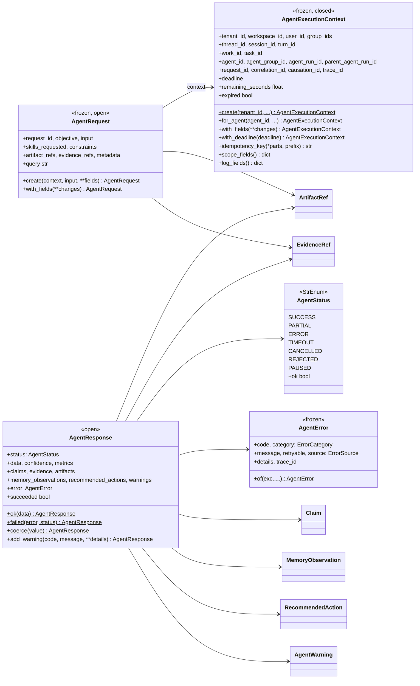
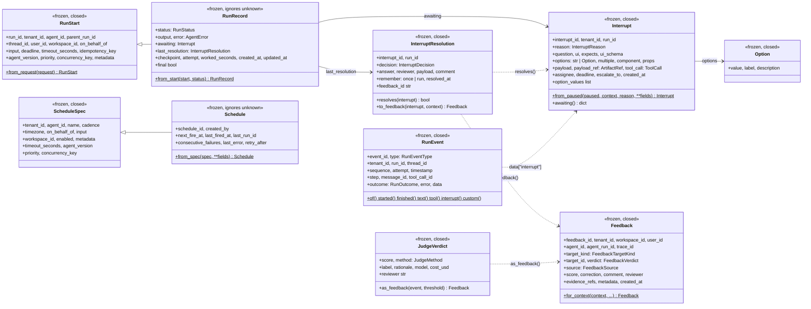
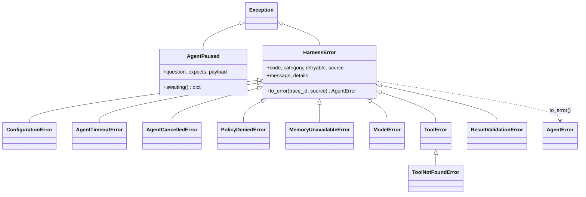
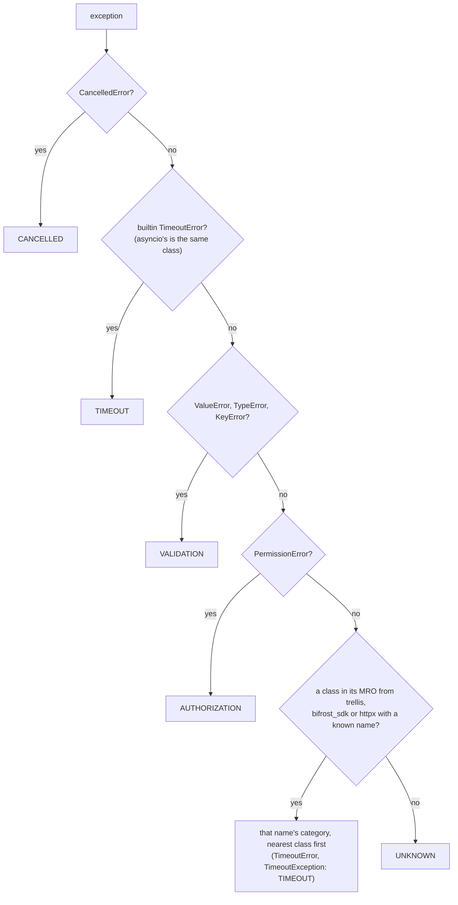
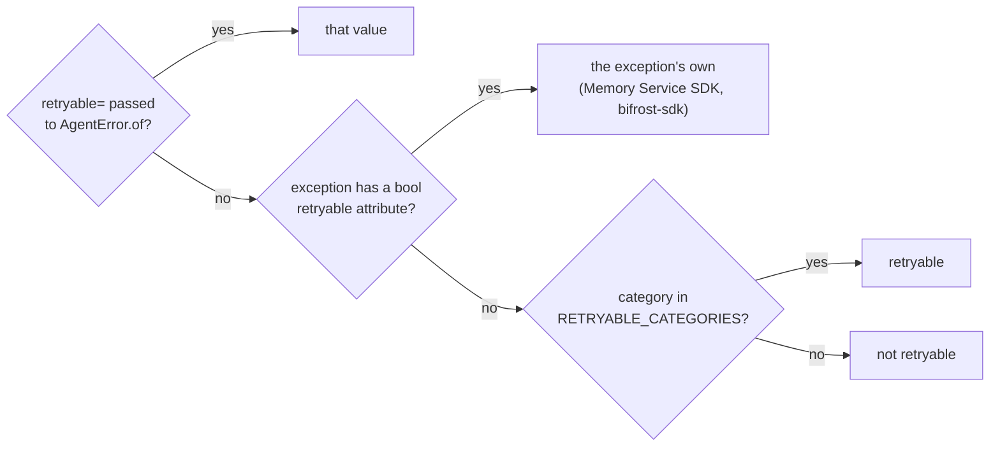

# Architecture

`trellis-contracts` is types and nothing else: Pydantic records, `StrEnum` vocabularies and
`typing.Protocol` ports. It has no runtime, transport or I/O, and its only dependency is
`pydantic` (`tests/test_contracts.py` fails the build if a module imports anything else).
This page shows how the pieces fit, who uses which, and the one state machine the package
owns. The decisions behind it are ADRs [0001](adr/0001-contracts-v2.md),
[0002](adr/0002-contracts-v3.md), [0003](adr/0003-documented-fields-and-closed-vocabularies.md),
[0004](adr/0004-no-run-store-port.md), [0005](adr/0005-run-working-time-and-agent-version.md),
[0006](adr/0006-interrupts-v2-and-queue-order.md) and
[0007](adr/0007-schedules-carry-queue-order-and-metadata.md).

## In the platform

Two sibling repos import it (agent-harness, and agent-runs with its SDK `trellis.runs`); the
Memory Service speaks some of its shapes without importing it; `bifrost-sdk` is independent
of it. The arrows from the harness are Way 1 of the
[two ways to use Trellis](../README.md#where-this-fits-two-ways-to-use-trellis); in Way 2 your
own code takes the harness's place and sends the same records with `trellis.runs` and
`trellis.memory`.

| Repo | What it takes from here |
| --- | --- |
| `agent-harness` | The run event stream (`RunEvent`, `RunEventType`, `RunOutcome`); the pause (`Interrupt`, `InterruptReason`, `InterruptDecision`, `InterruptResolution` and its `to_feedback`); its runs client's records (`RunStart`, `RunRecord`, `RunStatus.can_become`, `Schedule`, `ScheduleSpec`); tool types (`ToolSpec`, `ToolCall`, `ToolOutcome`, `ToolStatus`); `AgentExecutionContext`; errors (`AgentError`, `ConfigurationError`, `ToolError`, `ModelError`); `FeedbackVerdict`; the id helpers. Its `trellis.harness.redaction.Redactor` implements `TelemetryRedactor`, asserted in its `tests/contract/test_ports.py`. |
| `agent-runs` | Its stored and returned shapes: `RunStart` (its create body subclasses it), `RunRecord`, `RunStatus.can_become` (checked under a row lock), `Interrupt` (read back from `awaiting`), `InterruptResolution`, `InterruptDecision`, `Schedule`, `ScheduleSpec`, `AgentError`, `ErrorCategory`, `ArtifactRef`, `ToolCall`, and `now`, `new_id`, `stable_id`. |
| `agent-memory-service` | Nothing imported. Its `POST /v1/feedback` takes the `Feedback` record unchanged; `AgentExecutionContext.scope_fields()` returns exactly its `Scope` keywords; `OBSERVATION_KINDS` mirrors its `ObservationKind`; `classify()` maps its SDK's exceptions (module `trellis.*`) by class name, and `AgentError.of` keeps their own `retryable`. |
| `bifrost-sdk` | Nothing. The harness reaches models through it directly. `classify()` maps its exceptions (module `bifrost_sdk`) by class name, and `AgentError.of` keeps their own `retryable`. |

## Inside the package

Each arrow is an import. Records sit low, ports sit on top, and `__init__` re-exports every
public name.

## The ports

Every outbound dependency is a `runtime_checkable` `Protocol`: an implementation conforms by
shape, with no base class imported from here. The harness core is written against the port;
an adapter is injected behind it.

| Port | Methods | Use it to | Implemented today |
| --- | --- | --- | --- |
| `ModelClient` | `invoke`, `structured`, `stream` | call a model provider-neutrally | no sibling declares it; the harness calls models through `bifrost-sdk` |
| `ToolClient` | `list_tools`, `call` | list and call tools (local, MCP, gateway) | no sibling declares it |
| `ArtifactClient` | `put`, `get` | move large payloads out of results and state | no sibling declares it |
| `MemoryPort` | `enabled`, `retrieve`, `observe`, `record_input`, `record_output`, `describe` | read and write the Memory Service | no sibling declares it; the harness uses the `trellis-memory` SDK |
| `TelemetryProvider` | `start_span`, `record_event`, `record_metric`, `flush` | emit spans, events and metrics | no sibling declares it |
| `TelemetryRedactor` | `redact_attributes`, `redact_input`, `redact_output` | strip what may not leave the process | `agent-harness` `Redactor` (asserted) |
| `EvaluationProvider` | `score`, `submit_dataset_item` | write scores and dataset items to the tracing backend | no sibling declares it |
| `AgentPolicyProvider` | `authorize_execution`, `authorize_tool`, `authorize_model` | allow or refuse a run, a tool call, a model call | no sibling declares it |
| `EventSink` | `publish` | deliver a run's `RunEvent` stream | no sibling declares it |
| `Judge` | `judge` | score a finished run off the critical path | no sibling declares it |
| `AgentDirectory` | `get`, `find`, `publish` | find agents another agent may call, as `AgentCard`s | no sibling declares it |
| `AgentInterceptor` | `name`, `order`, `before`, `after`, `on_error` | add a stage to the execution pipeline | no sibling declares it |

"No sibling declares it" means none of the four sibling repos asserts or imports that port
today. The port is still the seam an adapter is written against, and this package's tests
check each one against a double with the exact signatures (`tests/test_ports.py`,
`tests/test_contracts_v2.py`).

Runs have no port (ADR 0004). A run is kept beyond the process by agent-runs, and its client
is `trellis.runs.RunsClient` (pip `trellis-runs`, shipped from agent-runs). Its verbs are the
service's operation ids (`start`, `claim`, `heartbeat`, `pause`, `resume`, `finish`, `get`,
`list`), and it sends and returns the types in this package: `RunStart`, `Interrupt`,
`InterruptResolution` and `RunRecord`.

## A run's lifecycle

`RunStatus.can_become(target)` is the one transition check. It reads the `_TRANSITIONS` table
in `runs.py`, and a final status has no entry, so it moves nowhere. `RunRecord.from_start`
only creates `QUEUED` or `RUNNING` records. The labels are `RunsClient` verbs.

`RunRecord` checks these whenever it is built:

* A `PAUSED` record carries `awaiting` (the `Interrupt`), and no other record does. The
  interrupt names the same `run_id` and `tenant_id` as the record.
* Only `ERROR`, `TIMEOUT` and `REJECTED` carry an `error`.
* A final record carries no `checkpoint`.
* `attempt >= 1`, and every timestamp is timezone-aware.

`RunOutcome.from_status` maps a settled status to what `RUN_FINISHED` reports. `PAUSED`
becomes `interrupt`, the endings become their lower-case names, and `QUEUED` and `RUNNING`
raise `ValueError` because they have no outcome yet.

### Pausing, answering and resuming

A run that pauses for an approval, driven the way the contract expects. agent-harness
pauses through its own `Runtime.ask` rather than raising `AgentPaused`, but it resumes in this
order: agent-runs accepts the resolution before the feedback is sent, so a decision that never
took effect is never learned from.

## The records

### Request, response and context

"Frozen" models refuse assignment. "Closed" ones refuse unknown fields (`extra="forbid"`),
and "open" ones keep them (`extra="allow"`).

### Runs, interrupts, feedback and schedules

`Interrupt` validation: the question is not blank; an `APPROVAL` carries `tool_call`, a
`CHOICE` carries `options`, a `REVIEW` carries `expects`; `escalate_to` needs a `deadline`;
option values are distinct and not blank; `multiple` needs `options` or `expects`; `props`
needs a `component` (a component needs no `expects`).
`InterruptResolution` validation: an `EDIT` carries the edited arguments in `payload`; only
an `APPROVE` may be remembered for the run (`remember="run"`).
`Feedback` validation: `target_id` is not blank, a `CORRECT` or `EDIT` verdict carries a
`correction`, and `score` is a number in [0, 1] (strict, so `True` is not read as `1.0`).

`to_feedback` returns a record for `APPROVE`, `REJECT` and `EDIT` of a tool call, and `None`
for `ANSWER`, `CANCEL` or an interrupt without a tool call. It raises `ValueError` when the
resolution, interrupt and context do not name the same run and tenant.

### Agent identity and the A2A card

Every URL on a card (`url`, `documentation_url`, `icon_url`, the provider's and each
interface's) must be http(s) with a host.

### Errors

`AgentPaused` is deliberately not a `HarnessError`, because a pause is not a failure.
`AgentError.of(exc)` normalises any exception. A `HarnessError` keeps its own
classification, and anything else is sorted by `classify()`:

Then whether it is retryable, first answer wins:

Only `TIMEOUT`, `RATE_LIMIT` and `DEPENDENCY` are retryable by category
(`errors.RETRYABLE_CATEGORIES`).

`AgentError.source` is an `ErrorSource`: the component that reported the failure, never the
exception class (that is `code`). Every value but `memory` is one a sibling repo passes today:

| Source | Set by |
| --- | --- |
| `function`, `langgraph`, `openai_agents`, `claude_agent_sdk`, `react` | the harness, for every failed run (the adapter's name) |
| `tools` | the harness's tool layer (a tool missing from the run, or called outside one) |
| `mcp` | the harness's Bifrost client, as `mcp.<tool>`: stored as `mcp`, with the tool in `details.source_detail` |
| `a2a` | the harness's A2A client (a remote agent failed or ended badly) |
| `memory` | nobody yet: kept for a Memory Service failure (`MemoryUnavailableError`) |
| `agent-runs` | agent-runs: a lease that lapsed on every attempt, an interrupt nobody answered, a schedule that could not fire |

## Wire conventions

* **Written records refuse unknown fields**, so a producer's typo is an error: `RunStart`,
  `RunEvent`, `Interrupt`, `InterruptResolution`, `Feedback`, `JudgeVerdict`, `ScheduleSpec`
  and `AgentExecutionContext`.
* **Records read back ignore unknown fields**, so a newer peer does not break an older reader:
  `RunRecord` and `Schedule` (from a store) and `AgentCard` with its parts (from another
  agent).
* **Every timestamp on a run, interrupt, event, feedback or schedule is timezone-aware**
  (`AwareDatetime`), and `ids.now()` is UTC.
* **Every field is described.** Each model field carries a one-line `Field(description=...)`
  with its unit, format and allowed values, so the JSON Schema (and agent-runs' OpenAPI
  document) documents every property. `tests/test_field_docs.py` keeps it that way.
* **Closed vocabularies are typed.** Statuses, reasons, decisions, kinds and verdicts are
  `StrEnum`s. `ErrorSource`, `ToolSource`, `ObservationKind` and `InterruptUI` are `Literal`s,
  so a caller's string literal still type-checks. The fields left as `str` on purpose
  (`ToolSpec.side_effects`, `EvidenceRef.source_type`, the A2A transports, ...) are listed in
  ADR 0003 with the reason for each.
* **Payloads that leave the process are unredacted** (`RunEvent.data`,
  `Interrupt.awaiting()`). The surface that sends them out passes them through a
  `TelemetryRedactor`.
* **Ids carry a prefix**: `run_`, `req_`, `int_`, `evt_`, `fb_`, `sch_`.
