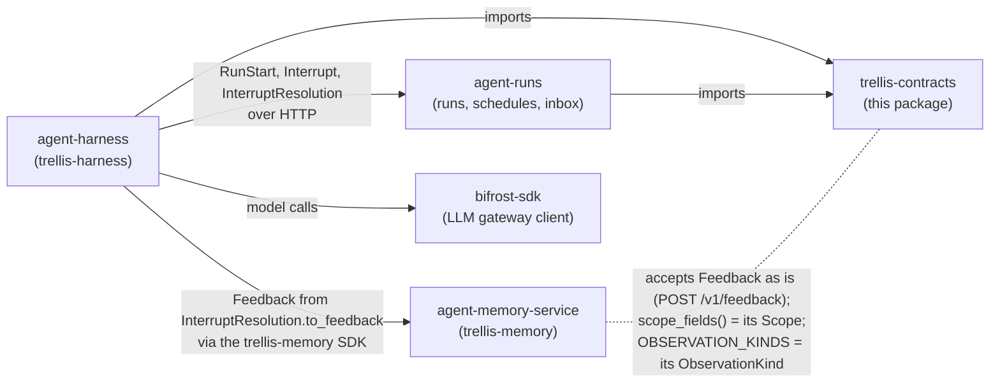
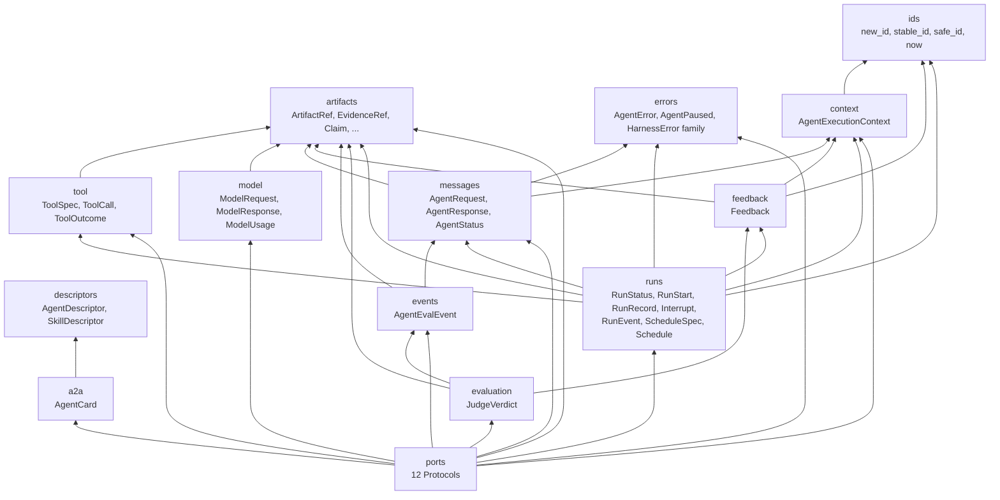
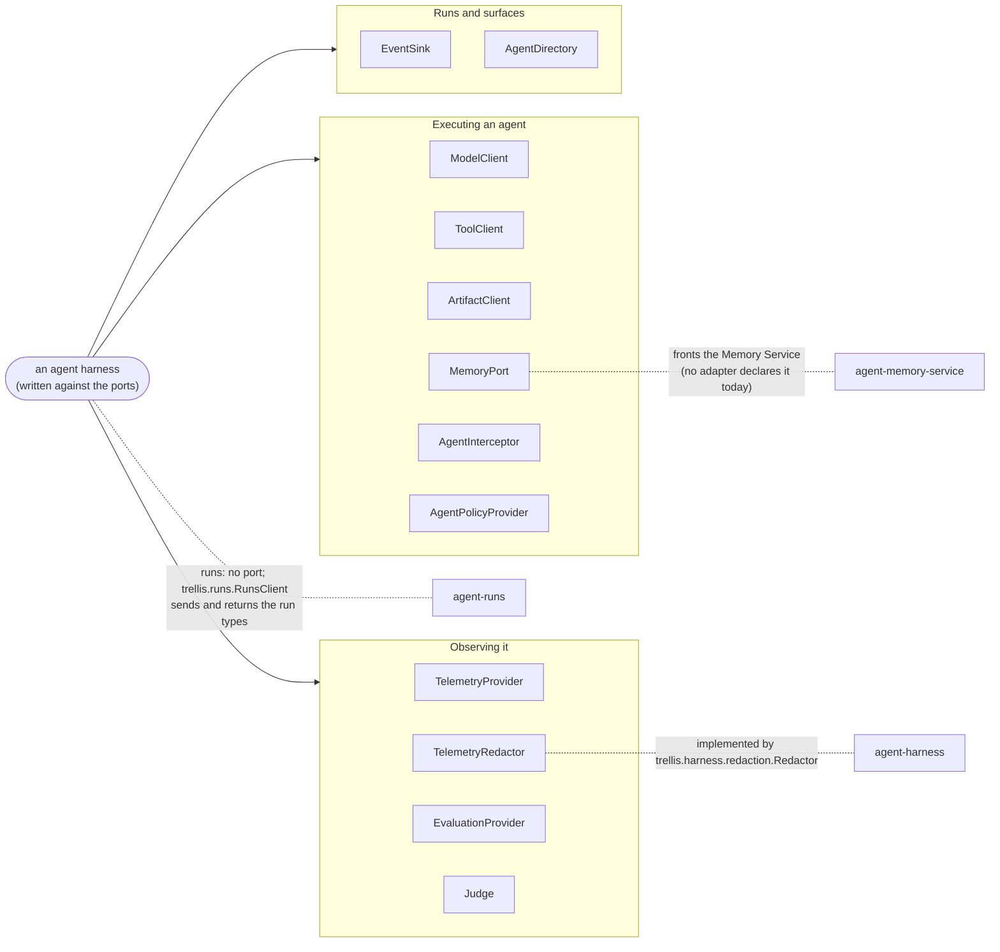
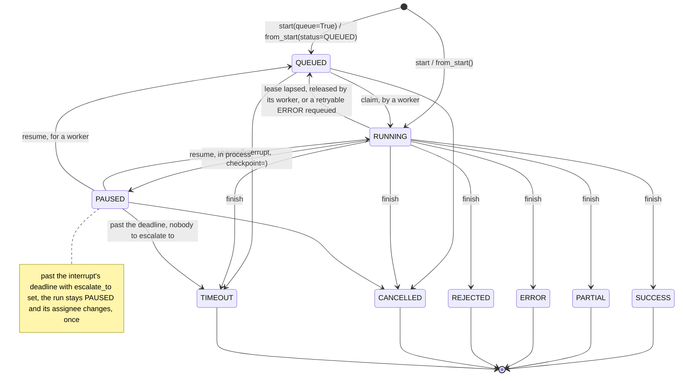
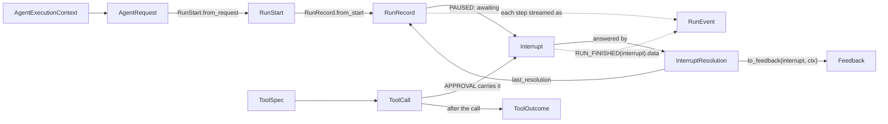
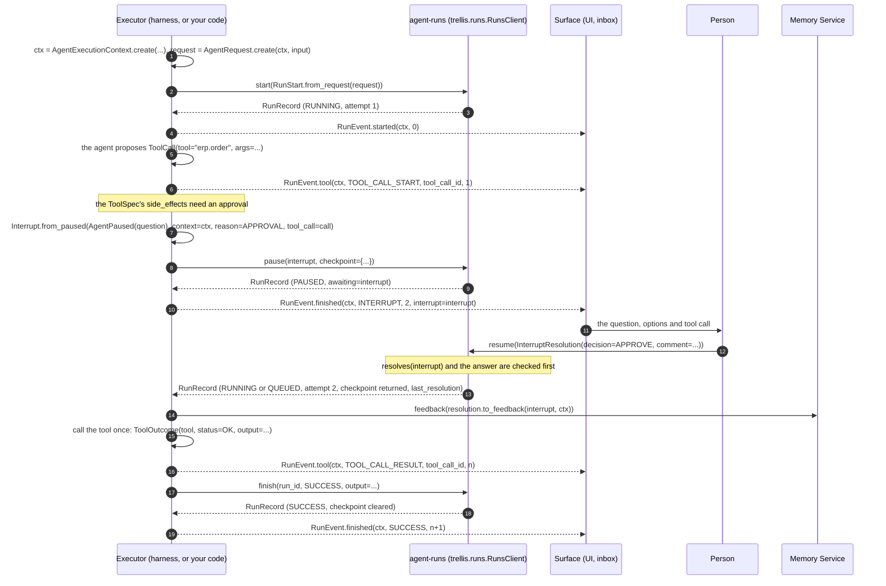
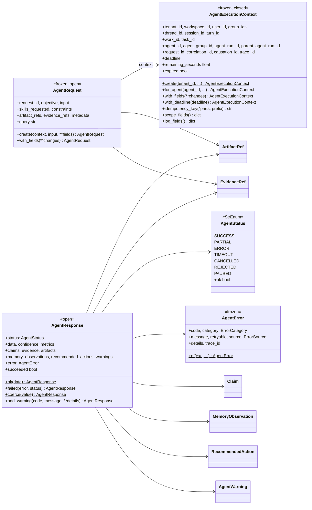
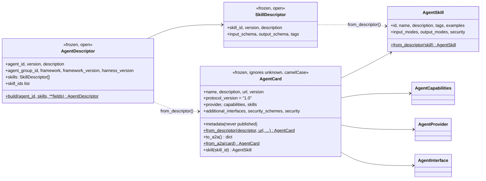
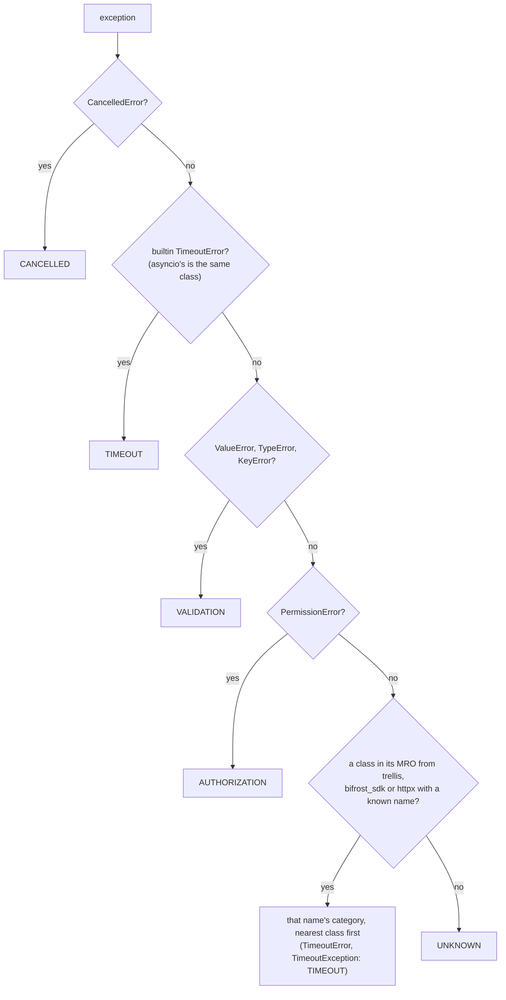
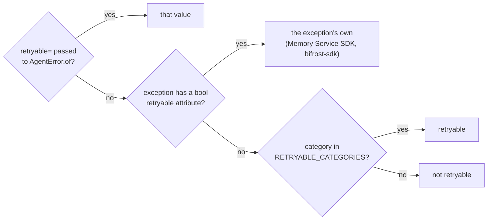

# Architecture

`trellis-contracts` is types and nothing else: Pydantic records, `StrEnum` vocabularies and
`typing.Protocol` ports. It has no runtime, transport or I/O, and its only dependency is
`pydantic` (`tests/test_contracts.py` fails the build if a module imports anything else).
This page shows how the pieces fit, who uses which, and the one state machine the package
owns. The decisions behind it are the [ADRs](adr/README.md), 0001 to 0007.

Contents: [in the platform](#in-the-platform) ·
[inside the package](#inside-the-package) · [the ports](#the-ports) ·
[a run's lifecycle](#a-runs-lifecycle) ·
[the records across a run](#the-records-across-a-run) · [the records](#the-records) ·
[wire conventions](#wire-conventions)

## In the platform

Trellis is five repos. This one is the vocabulary the other four agree on:

| Repo | What it is | Relation to this package |
|---|---|---|
| **agent-contracts** (this repo) | the shared records and ports, types only | — |
| [agent-harness](https://github.com/amitmohapatra/agent-harness) | runs your agent (any framework) with memory, runs, governance, tools and evals | imports it; builds and reads every record |
| [agent-runs](https://github.com/amitmohapatra/agent-runs) | durable runs, the inbox, schedules, workers and webhooks, plus its SDK `trellis.runs` | imports it; its HTTP API is built from these models |
| [agent-memory-service](https://github.com/amitmohapatra/agent-memory-service) | memory, context and feedback for agents | speaks some shapes without importing them |
| [bifrost-sdk](https://github.com/amitmohapatra/bifrost-sdk) | the client for the Bifrost model and MCP gateway | independent; `classify()` reads its errors |

Two sibling repos import it (agent-harness, and agent-runs with its SDK `trellis.runs`); the
Memory Service speaks some of its shapes without importing it; `bifrost-sdk` is independent
of it. The arrows from the harness are Way 1 of the
[two ways to use Trellis](../README.md#where-this-fits-two-ways-to-use-trellis); in Way 2 your
own code takes the harness's place and sends the same records with `trellis.runs` and
`trellis.memory`.

| Repo | What it takes from here |
| --- | --- |
| `agent-harness` | The run event stream (`RunEvent`, `RunEventType`, `RunOutcome`); the pause (`Interrupt`, `InterruptReason`, `InterruptDecision`, `InterruptResolution` and its `to_feedback`); its runs client's records (`RunStart`, `RunRecord`, `RunStatus.can_become`, `Schedule`, `ScheduleSpec`); tool types (`ToolSpec`, `ToolCall`, `ToolOutcome`, `ToolStatus`); `AgentExecutionContext`; errors (`AgentError`, `ConfigurationError`, `ToolError`, `ModelError`); `FeedbackVerdict`; the id helpers. Its `trellis.harness.redaction.Redactor` implements `TelemetryRedactor`, asserted in its `tests/contract/test_ports.py`. |
| `agent-runs` | Its stored and returned shapes: `RunStart` (its create body subclasses it), `RunRecord`, `RunStatus.can_become` (checked under a row lock), `Interrupt` (read back from `awaiting`), `InterruptResolution`, `InterruptDecision`, `Schedule`, `ScheduleSpec`, `AgentError`, `ErrorCategory`, `ArtifactRef`, `ToolCall`, and `now`, `new_id`, `stable_id`. |
| `agent-memory-service` | Nothing imported. Its `POST /v1/feedback` takes the `Feedback` record unchanged; `AgentExecutionContext.scope_fields()` returns exactly its `Scope` keywords; `OBSERVATION_KINDS` mirrors its `ObservationKind`; `classify()` maps its SDK's exceptions (module `trellis.*`) by class name, and `AgentError.of` keeps their own `retryable`. |
| `bifrost-sdk` | Nothing. The harness reaches models through it directly. `classify()` maps its exceptions (module `bifrost_sdk`) by class name, and `AgentError.of` keeps their own `retryable`. |

## Inside the package

Each arrow is an import. Records sit low, ports sit on top, and `__init__` re-exports every
public name.

## The ports

Every outbound dependency is a `runtime_checkable` `Protocol`: an implementation conforms by
shape, with no base class imported from here. The harness core is written against the port;
an adapter is injected behind it.

| Port | Methods | Use it to | Implemented today |
| --- | --- | --- | --- |
| `ModelClient` | `invoke`, `structured`, `stream` | call a model provider-neutrally | no sibling declares it; the harness calls models through `bifrost-sdk` |
| `ToolClient` | `list_tools`, `call` | list and call tools (local, MCP, gateway) | no sibling declares it |
| `ArtifactClient` | `put`, `get` | move large payloads out of results and state | no sibling declares it |
| `MemoryPort` | `enabled`, `retrieve`, `observe`, `record_input`, `record_output`, `describe` | read and write the Memory Service | no sibling declares it; the harness uses the `trellis-memory` SDK |
| `TelemetryProvider` | `start_span`, `record_event`, `record_metric`, `flush` | emit spans, events and metrics | no sibling declares it |
| `TelemetryRedactor` | `redact_attributes`, `redact_input`, `redact_output` | strip what may not leave the process | `agent-harness` `Redactor` (asserted) |
| `EvaluationProvider` | `score`, `submit_dataset_item` | write scores and dataset items to the tracing backend | no sibling declares it |
| `AgentPolicyProvider` | `authorize_execution`, `authorize_tool`, `authorize_model` | allow or refuse a run, a tool call, a model call | no sibling declares it |
| `EventSink` | `publish` | deliver a run's `RunEvent` stream | no sibling declares it |
| `Judge` | `judge` | score a finished run off the critical path | no sibling declares it |
| `AgentDirectory` | `get`, `find`, `publish` | find agents another agent may call, as `AgentCard`s | no sibling declares it |
| `AgentInterceptor` | `name`, `order`, `before`, `after`, `on_error` | add a stage to the execution pipeline | no sibling declares it |

"No sibling declares it" means none of the four sibling repos asserts or imports that port
today. The port is still the seam an adapter is written against, and this package's tests
check each one against a double with the exact signatures (`tests/test_ports.py`,
`tests/test_contracts_v2.py`).

Runs have no port (ADR 0004). A run is kept beyond the process by agent-runs, and its client
is `trellis.runs.RunsClient` (pip `trellis-runs`, shipped from agent-runs). Its verbs are the
service's operation ids (`start`, `claim`, `heartbeat`, `pause`, `resume`, `finish`, `get`,
`list`), and it sends and returns the types in this package: `RunStart`, `Interrupt`,
`InterruptResolution` and `RunRecord`.

## A run's lifecycle

`RunStatus.can_become(target)` is the one transition check. It reads the `_TRANSITIONS` table
in `runs.py`, and a final status has no entry, so it moves nowhere. `RunRecord.from_start`
only creates `QUEUED` or `RUNNING` records. The labels are `RunsClient` verbs.

This is the contract: which moves are allowed. agent-runs owns *when* each move happens (the
ticker, leases, retries and escalation), and
[its lifecycle diagram](https://github.com/amitmohapatra/agent-runs/blob/main/docs/ARCHITECTURE.md#the-run-lifecycle)
labels every edge with its trigger. Where the two seem to differ, that diagram is the
authority on triggers and this table on what is allowed.

`RunRecord` checks these whenever it is built:

* A `PAUSED` record carries `awaiting` (the `Interrupt`), and no other record does. The
  interrupt names the same `run_id` and `tenant_id` as the record.
* Only `ERROR`, `TIMEOUT` and `REJECTED` carry an `error`.
* A final record carries no `checkpoint`.
* `attempt >= 1`, and every timestamp is timezone-aware.

`RunOutcome.from_status` maps a settled status to what `RUN_FINISHED` reports. `PAUSED`
becomes `interrupt`, the endings become their lower-case names, and `QUEUED` and `RUNNING`
raise `ValueError` because they have no outcome yet.

## The records across a run

Which record is made where, from what, as one run goes from start to finish through a tool
approval. Every arrow carries one of this package's types. The harness plays "executor" in
Way 1; in Way 2 your own code does, with `trellis.runs` and `trellis.memory`.
[examples/04_pause_answer_resume.py](../examples/04_pause_answer_resume.py) runs the same steps
without any service.

The order matters at steps 12 to 14: agent-runs accepts the resolution before the feedback is
sent, so a decision that never took effect is never learned from. The harness pauses through
its own `Runtime.ask` rather than raising `AgentPaused`, but it resumes in this order. Events
are numbered per attempt (`RunEvent.sequence` restarts at 0 on attempt 2), and a sink dedupes
on run, attempt and sequence.

### What a pause carries

A paused run waits on exactly one `Interrupt`: a `QUESTION`, an `APPROVAL` (carries the tool
call), a `REVIEW` (carries in `expects` what a correction looks like), a `CHOICE` (carries its
`options`) or an `AUTH`. `assignee` is who answers (`user:u1`, `role:procurement`). Past the
`deadline` the run goes to `escalate_to`, or times out when nobody is named.

An option is a plain string or an `Option(value, label, description)`; the answer carries the
value. With `multiple=True` the answer is a list of distinct values. `component` names the
asker's own screen, which a surface that has it renders with `props` passed as they are; any
other surface renders `ui`. `ui_schema` gives widget hints for the form `expects` describes
(the react-jsonschema-form `uiSchema` convention). agent-runs checks an answer against
`expects` and the options (`trellis.runs.answers`), also when a component collected it.

The executor pauses with an opaque `checkpoint` (`RunsClient.pause(interrupt, checkpoint=)`):
its resume journal and the framework's own resume state. The record returns it on every read
and claim, so another worker resumes without repeating side effects. Finishing clears it.

### The one scope rule

`AgentExecutionContext.scope_fields()` applies the Memory Service's coherence rules at this
boundary: `agent_run_id` needs `agent_id`, `session_id` needs `thread_id`, and `turn_id` needs
`session_id`. A context that cannot be expressed coherently is corrected here rather than
rejected at the far end of an HTTP call.

## The records

### Request, response and context

"Frozen" models refuse assignment. "Closed" ones refuse unknown fields (`extra="forbid"`),
and "open" ones keep them (`extra="allow"`).

### Runs, interrupts, feedback and schedules

`Interrupt` validation: the question is not blank; an `APPROVAL` carries `tool_call`, a
`CHOICE` carries `options`, a `REVIEW` carries `expects`; `escalate_to` needs a `deadline`;
option values are distinct and not blank; `multiple` needs `options` or `expects`; `props`
needs a `component` (a component needs no `expects`).
`InterruptResolution` validation: an `EDIT` carries the edited arguments in `payload`; only
an `APPROVE` may be remembered for the run (`remember="run"`).
`Feedback` validation: `target_id` is not blank, a `CORRECT` or `EDIT` verdict carries a
`correction`, and `score` is a number in [0, 1] (strict, so `True` is not read as `1.0`).

`to_feedback` returns a record for `APPROVE`, `REJECT` and `EDIT` of a tool call, and `None`
for `ANSWER`, `CANCEL` or an interrupt without a tool call. It raises `ValueError` when the
resolution, interrupt and context do not name the same run and tenant.

### Agent identity and the A2A card

Every URL on a card (`url`, `documentation_url`, `icon_url`, the provider's and each
interface's) must be http(s) with a host.

### Errors

`AgentPaused` is deliberately not a `HarnessError`, because a pause is not a failure.
`AgentError.of(exc)` normalises any exception. A `HarnessError` keeps its own
classification, and anything else is sorted by `classify()`:

Then whether it is retryable, first answer wins:

Only `TIMEOUT`, `RATE_LIMIT` and `DEPENDENCY` are retryable by category
(`errors.RETRYABLE_CATEGORIES`).

`AgentError.source` is an `ErrorSource`: the component that reported the failure, never the
exception class (that is `code`). Every value but `memory` is one a sibling repo passes today:

| Source | Set by |
| --- | --- |
| `function`, `langgraph`, `openai_agents`, `claude_agent_sdk`, `react` | the harness, for every failed run (the adapter's name) |
| `tools` | the harness's tool layer (a tool missing from the run, or called outside one) |
| `mcp` | the harness's Bifrost client, as `mcp.<tool>`: stored as `mcp`, with the tool in `details.source_detail` |
| `a2a` | the harness's A2A client (a remote agent failed or ended badly) |
| `memory` | nobody yet: kept for a Memory Service failure (`MemoryUnavailableError`) |
| `agent-runs` | agent-runs: a lease that lapsed on every attempt, an interrupt nobody answered, a schedule that could not fire |

## Wire conventions

* **Written records refuse unknown fields**, so a producer's typo is an error: `RunStart`,
  `RunEvent`, `Interrupt`, `Option`, `InterruptResolution`, `Feedback`, `JudgeVerdict`,
  `ScheduleSpec` and `AgentExecutionContext`.
* **Records read back ignore unknown fields**, so a newer peer does not break an older reader:
  `RunRecord` and `Schedule` (from a store) and `AgentCard` with its parts (from another
  agent).
* **Every timestamp on a run, interrupt, event, feedback or schedule is timezone-aware**
  (`AwareDatetime`), and `ids.now()` is UTC.
* **Every field is described.** Each model field carries a one-line `Field(description=...)`
  with its unit, format and allowed values, so the JSON Schema (and agent-runs' OpenAPI
  document) documents every property. `tests/test_field_docs.py` keeps it that way.
* **Closed vocabularies are typed.** Statuses, reasons, decisions, kinds and verdicts are
  `StrEnum`s. `ErrorSource`, `ToolSource`, `ObservationKind`, `InterruptUI` and
  `InterruptRemember` are `Literal`s,
  so a caller's string literal still type-checks. The fields left as `str` on purpose
  (`ToolSpec.side_effects`, `EvidenceRef.source_type`, the A2A transports, ...) are listed in
  ADR 0003 with the reason for each.
* **Payloads that leave the process are unredacted** (`RunEvent.data`,
  `Interrupt.awaiting()`). The surface that sends them out passes them through a
  `TelemetryRedactor`.
* **Ids carry a prefix**: `run_`, `req_`, `int_`, `evt_`, `fb_`, `sch_`.

### One definition on every wire

The same record means the same thing to every block because it is defined once, here:

* **One definition.** agent-runs' service and its SDK (`trellis.runs`) and the harness import
  these models; none redefines them. The Memory Service does not import the package but speaks
  its shapes: `POST /v1/feedback` takes a `Feedback` unchanged, `scope_fields()` returns its
  `Scope` keywords, and `OBSERVATION_KINDS` is its `ObservationKind`.
* **The API is built from them.** agent-runs' OpenAPI document embeds these models
  (`RunCreate` subclasses `RunStart`; `RunRecord`, `Interrupt`, `InterruptResolution`,
  `Schedule`, `ScheduleSpec`, `AgentError` and `ArtifactRef` are used as they are). Its CI fails
  when the committed document differs from the code's, and `trellis.runs`' tests check every
  model it sends or parses against that document.
* **Versioned pins.** A release that changes a record is a new version the siblings' pins must
  admit before anyone sends it. The current pins are in [versioning.md](versioning.md), and
  each change has its ADR.

`A2A_PROTOCOL_VERSION` is `"1.0"`, the protocol `a2a-sdk` 1.x speaks. `trellis-harness`'s A2A
surface builds its served card with the SDK's own `PROTOCOL_VERSION_CURRENT`, so the two must
agree. No test in a sibling repo asserts that yet, so a change to either needs the other
checked by hand.
